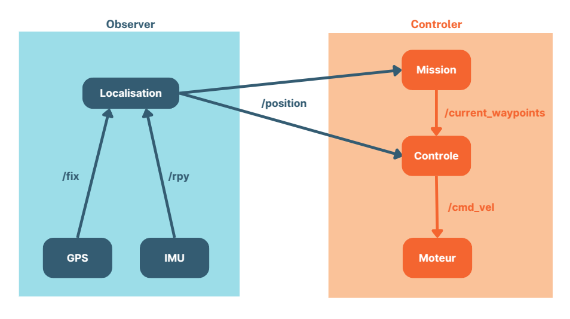

# voiture2A-ros

## Structure des fichiers

📁 **docker/**
  - 📝 `build_arm.sh`
  - 📝 `build_x86_64.sh`
  - 📝 `run_docker_build.sh`

📁 **build/**

📁 **install/**

📁 **log/**

📁 **src/**
  - 📁 **gpsd_client/**
  - 📁 **icm20948_driver/**
  - 📁 **notre_package/**
  - 📁 **voiture2a_motors_driver/**
  - 📁 **calibration/**
    - 📝 `calibration_node.py`
    - 📝 `__init__.py`
    - 📁 **resource/**
    - 📝 `package.xml`
    - 📝 `setup.cfg`
    - 📝 `setup.py`

📁 **Simulation/**
  - 📝 `bike_control.py`
  - 📝 `gps.py`
  - 📝 `gyro.py`
  - 📝 `imu.py`
  - 📝 `tricycle-cadROS.ttt`
  - 📁 **ws_ros/**
    - 📁 **build/**
    - 📁 **install/**
    - 📁 **log/**
    - 📁 **src/**
      - 📁 **notre_package/**
        - 📝 `package.xml`
        - 📁 **resource/**
        - 📝 `setup.cfg`
        - 📝 `setup.py`
        - 📁 **launch/**
          - 📝 `multi_launch.py`
        - 📁 **notre_package/**
          - 📝 `control.py`
          - 📝 `__init__.py`
          - 📝 `localization.py`
          - 📝 `waypoint.py`


## Node architecture



### Motors node
Voir [voiture2a_motors_driver](./src/voiture2a_motors_driver/README.md) package

### GNSS node
Voir [gpsd client](./src/gpsd_client/README.md) package

### IMU node
Voir [icm20948_driver](./src/icm20948_driver/README.md) package

### Nos nodes (Localisation, Mission, Control)
Voir [notre_package](./src/notre_package/README.md)

## Docker
On utilise docker pour éviter de compiler sur la rasberry pi. On utilise donc le fichier `build_arm.sh` pour compiler notre programme sur arm64. On obtient ainsi un dossier .arm65 qui contient le résultat de la compilation. Ainsi le fichier .arm64/install peut être envoyé sur la rasberry pi pour être utilisé avec ROS2.

## Simulation avec CoppeliaSim
- Ouvrir CoppeliaSim depuis le terminal
- Ouvrir la scène Simulation/tricycle-cadROS.ttt
- Aller dans le dossier Simulation/ws_ros et faire un colcon build puis source install/setup.bash
- Lancer la simulation dans Coppelia
- Lancer le multi_launch avec :
```
ros2 launch notre_package multi_launch.py
```

### Schéma du Contrôleur de Suivi de Ligne

#### 1. Entrées du système :
- Position actuelle du robot : $ (x, y, \text{yaw}) $
- Waypoints définissant la trajectoire : $ A(A_x, A_y) $, $ B(B_x, B_y) $

#### 2. Calcul de la direction de la ligne :
- Vecteur directeur de la ligne :
  $$ \overrightarrow{AB} = (B_x - A_x, B_y - A_y) $$
- Cap de la ligne (orientation désirée sans correction) :
  $$ \varphi = -\arctan2(B_y - A_y, B_x - A_x) $$

#### 3. Calcul de l'erreur latérale :
- Normalisation du vecteur :
  $$ \mathbf{n} = \frac{\overrightarrow{AB}}{||\overrightarrow{AB}||} $$
- Distance latérale du robot par rapport à la droite :
  $$ e = n_x (y - A_y) - n_y (x - A_x) $$

#### 4. Correction de l'orientation :
- Gain de correction de l'erreur latérale : $ K_p $
- Gain de correction de l'orientation : $ K_{steering} $
- Cap désiré avec correction :
  $$ \theta_d = \varphi - K_p \tanh\left(\frac{e}{K_{steering}}\right) $$
- Erreur d'orientation :
  $$ \text{error\_heading} = \theta_d - \text{yaw} $$

#### 5. Contrôle de la vitesse :
- Commande de direction avec saturation à $ \pm 60^\circ $ :
  $$ \delta = \text{clip}(-\text{error\_heading}, -\frac{\pi}{3}, \frac{\pi}{3}) $$
- Vitesse linéaire fixe :
  $$ v = 0.2 \text{ m/s} $$

#### 6. Sorties :
- **Commande de position angulaire** : $ \delta $ (commande de rotation)
- **Commande de vitesse linéaire** : $ v $ (avance du robot)

**Résumé du fonctionnement** :  
1. Le robot calcule la ligne reliant les waypoints.  
2. Il mesure son écart par rapport à cette ligne.  
3. Il ajuste son orientation en fonction de l'erreur latérale.  
4. Il applique une commande de rotation et avance avec une vitesse constante.


## Implémentation sur la voiture réelle 
Avant de pouvoir utiliser la voiture il faut calibrer le magnétomètre, étalonner le servomoteur et choisir les points GPS que la voiture devra suivre.
### Calibration du magnétomètre
- Se placer dans une zone sans perturbation du champs magnétique (à l'extérieur dans un jardin par exemple)
- Lancer le noeud calibration_node avec la commande : 
```
ros2 run calibration calibration_node
```
- Suivre les étapes en faisant attention au décompte
- Modifier le fichier `src/icm20948_driver/config/icm.yaml`, remplacer `hardIronOffset` et `softIronMatrix` par les matrices enregistrées dans le ficher .txt

### Étalonnage du servomoteur
- Lancer le noeud motors_node avec la commande:
```
ros2 run voiture2a_motors_driver motors_node
```
- Obtenir la commande nécessaire pour obtenir un angle de pi/4
- Obtenir la commande nécessaire pour avoir les roues droites
- Obtenir la commande nécessaire pour avoir un angle de -pi/4
- Compléter le code `src/notre_package/notre_package/control.py` ligne 77

##### Remarque: Il est possible que la connexion à une télécommande soit nécessaire
 
 ### Choix des points GPS
 Il suffit de compléter la liste dans le fichier `src/notre_package/notre_package/waypoint.py` ligne 38