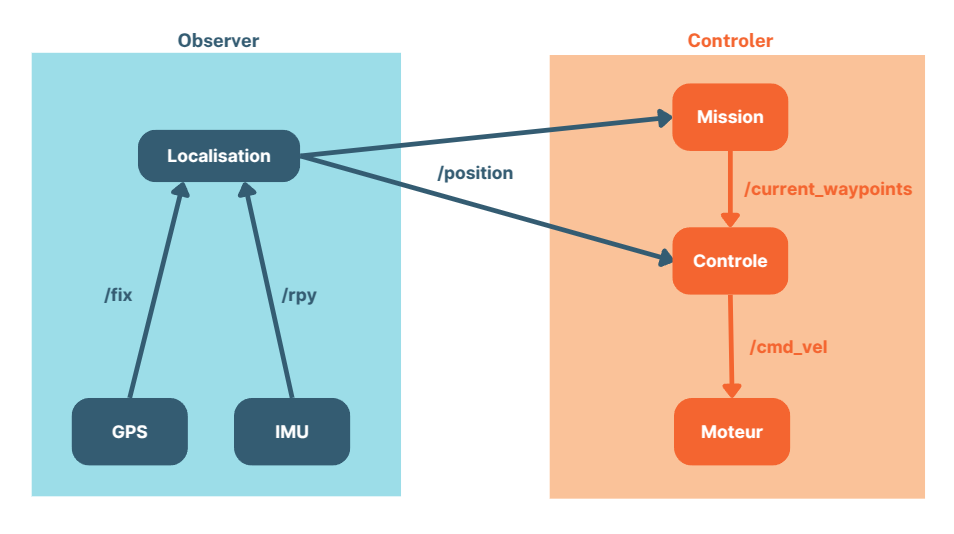

# voiture2A-ros
Ce projet ROS 2 permet de piloter une voiture autonome équipée de capteurs (GNSS, IMU, moteurs) avec une architecture modulaire incluant simulation sous CoppeliaSim et un suivi d'une série points GPS.
## 🏛️ Node architecture



### Motors node
Voir [voiture2a_motors_driver](./src/voiture2a_motors_driver) package

### GNSS node
Voir [gpsd client](./src/gpsd_client) package

### IMU node
Voir [icm20948_driver](./src/icm20948_driver) package

### Nos nodes (Localisation, Mission, Control)
Voir [notre_package](./src/notre_package)

## 🐳 Docker
On utilise docker pour éviter de compiler sur la rasberry pi. On utilise donc le fichier `build_arm.sh` pour compiler notre programme sur arm64. On obtient ainsi un dossier .arm65 qui contient le résultat de la compilation. Ainsi le fichier .arm64/install peut être envoyé sur la rasberry pi pour être utilisé avec ROS2.

## 💻 Simulation avec CoppeliaSim
- Ouvrir CoppeliaSim depuis le terminal
- Ouvrir la scène Simulation/tricycle-cadROS.ttt
- Aller dans le dossier Simulation/ws_ros et faire un colcon build puis source install/setup.bash
- Lancer la simulation dans Coppelia
- Lancer le multi_launch avec :
```
ros2 launch notre_package multi_launch.py
```

### 🧭 Schéma du Contrôleur de Suivi de Ligne

#### 1. Entrées du système

- **Position actuelle du robot** : (x, y, yaw)
- **Waypoints définissant la trajectoire** :  
  - Point A : (Ax, Ay)  
  - Point B : (Bx, By)

---

#### 2. Calcul de la direction de la ligne

- **Vecteur directeur AB** = (Bx - Ax, By - Ay)
- **Cap de la ligne (orientation visée sans correction)** :  
  phi = -arctan2(By - Ay, Bx - Ax)

---

#### 3. Calcul de l’erreur latérale

- **Vecteur normalisé n** = AB / ||AB||
- **Erreur latérale e** = nx * (y - Ay) - ny * (x - Ax)

---

#### 4. Correction de l’orientation

- **Gains de correction** :  
  - Kp : gain proportionnel pour l’erreur latérale  
  - Ksteering : paramètre de lissage
- **Cap désiré corrigé** :  
  theta_d = phi - Kp * tanh(e / Ksteering)
- **Erreur d’orientation** :  
  error_heading = theta_d - yaw

---

#### 5. Contrôle de la vitesse

- **Commande de direction (saturée à ±60°)** :  
  delta = clip(-error_heading, -pi/3, pi/3)
- **Vitesse linéaire constante** :  
  v = 0.2 m/s

---

#### 6. Sorties

- **Commande angulaire (direction)** : delta
- **Commande linéaire (avance)** : v

**Résumé du fonctionnement** :  
1. Le robot calcule la ligne reliant les waypoints.  
2. Il mesure son écart par rapport à cette ligne.  
3. Il ajuste son orientation en fonction de l'erreur latérale.  
4. Il applique une commande de rotation et avance avec une vitesse constante.


## 🚗 Implémentation sur la voiture réelle 
Avant de pouvoir utiliser la voiture il faut calibrer le magnétomètre, étalonner le servomoteur et choisir les points GPS que la voiture devra suivre.
### Calibration du magnétomètre
- Se placer dans une zone sans perturbation du champs magnétique (à l'extérieur dans un jardin par exemple)
- Lancer le noeud calibration_node avec la commande : 
```
ros2 run calibration calibration_node
```
- Suivre les étapes en faisant attention au décompte
- Modifier le fichier `src/icm20948_driver/config/icm.yaml`, remplacer `hardIronOffset` et `softIronMatrix` par les matrices enregistrées dans le ficher .txt

### Étalonnage du servomoteur
- Lancer le noeud motors_node avec la commande:
```
ros2 run voiture2a_motors_driver motors_node
```
- Obtenir la commande nécessaire pour obtenir un angle de pi/4
- Obtenir la commande nécessaire pour avoir les roues droites
- Obtenir la commande nécessaire pour avoir un angle de -pi/4
- Compléter le code `src/notre_package/notre_package/control.py` ligne 77

##### Remarque : Il est possible que la connexion à une télécommande soit nécessaire
 
 ### Choix des points GPS
 Il suffit de compléter la liste dans le fichier `src/notre_package/notre_package/waypoint.py` ligne 38
